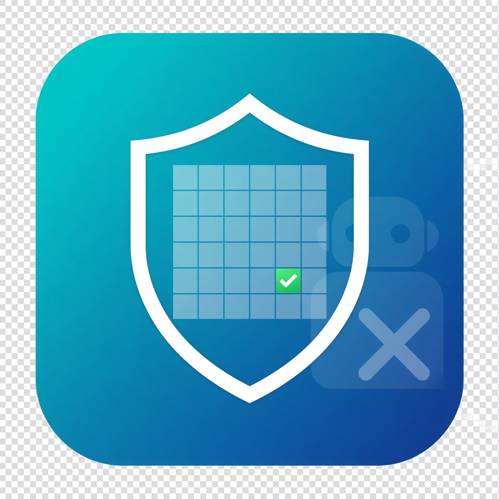
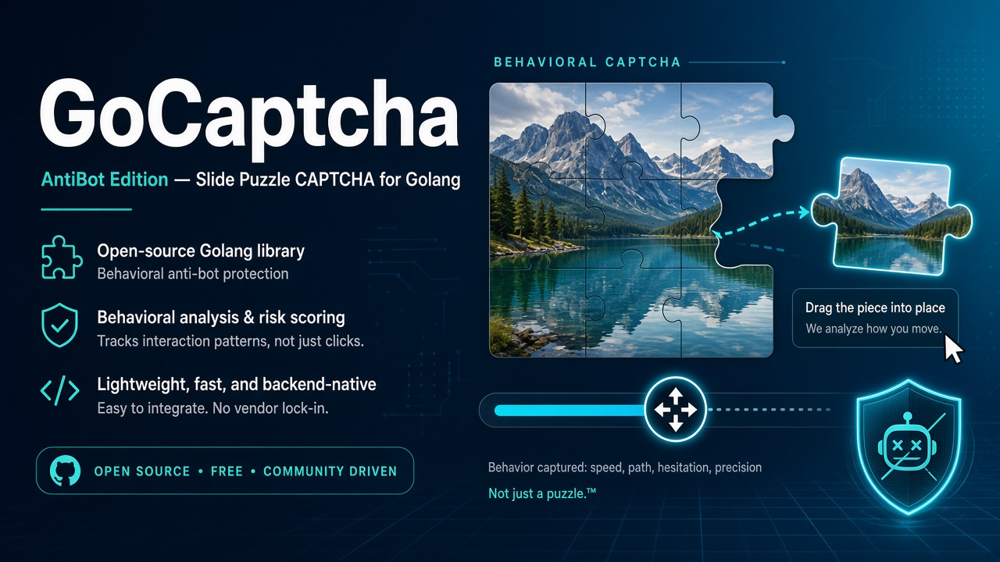

<div align="center">

<h1 style="margin: 0; padding: 0">GoCaptcha · AntiBot Edition</h1>
<p>Hardened behavioral CAPTCHA for Golang</p>
<a href="https://goreportcard.com/report/github.com/feerichnii/go-captcha"></a>
<a href="https://godoc.org/github.com/feerichnii/go-captcha"></a>
<a href="https://github.com/feerichnii/go-captcha/blob/master/LICENSE"></a>
</div>

<br/>

> English | [中文](README_zh.md)

<p align="center">
<b>GoCaptcha · AntiBot Edition</b> is a powerful, modular, and highly customizable behavioral CAPTCHA library for Golang. It provides all four interactive CAPTCHA types (<b>Click</b>, <b>Slide</b>, <b>Drag-Drop</b>, and <b>Rotate</b>) and layers a full <b>AntiBot</b> stack on top: server-only answers, cryptographic randomness, image interference, AEAD-encrypted challenges, behavior scoring, rate limiting, and adaptive proof-of-work.
</p>

<p align="center"> ⭐️ If it helps you, please give it a star.</p>

<div align="center"> 

</div>

<br/>
<hr/>
<br/>

## What's new in this build

This edition focuses on making the CAPTCHA hard for automated solvers without changing the ergonomics of the original API. Three things ship on top of upstream GoCaptcha:

- **Safer-by-default answers** — `GetPublicData()` returns everything the browser needs and nothing it shouldn't. The real answer (`GetData()`) never has to leave the server, and can be encrypted at rest (AES-256-GCM) by the `antibot` layer or sealed into an opaque AEAD token via [`v2/base/challenge`](v2/base/challenge).
- **Anti-solver image & RNG hardening** — answer geometry now uses `crypto/rand`, JPEG masters ship with added interference noise, slide tiles get decoy shadows and edge jitter, rotate masters get rim noise, and click thumbnails are deformed by default. See [SECURITY.md](SECURITY.md).
- **The `antibot` layer** — a drop-in orchestration package ([`v2/antibot`](v2/antibot)) that manages the challenge lifecycle (crypto ID, TTL, single-use, attempt caps), scores pointer trajectories, rate-limits per client, and issues adaptive proof-of-work to suspicious clients. Backed by in-memory or Redis storage.
- **Bundled high-complexity backgrounds** — a fresh set of dense, high-entropy background images ships under [`v2/resources/backgrounds`](v2/resources/backgrounds), so masters are harder to segment for OCR/contour-based solvers out of the box.

| Capability            | Upstream | AntiBot Edition |
|-----------------------|:--------:|:---------------:|
| Click / Slide / Drag / Rotate | ✅ | ✅ |
| Public vs. secret data split  | –  | ✅ `GetPublicData()` |
| Crypto RNG for answers        | –  | ✅ |
| Image interference / decoys   | –  | ✅ |
| Encrypted answers / AEAD tokens | –  | ✅ AES-256-GCM |
| Atomic single-use + attempts   | –  | ✅ `Incr` / `GETDEL` |
| Client binding + verify limits | –  | ✅ |
| Challenge lifecycle manager    | –  | ✅ `antibot` |
| Trajectory behavior scoring    | –  | ✅ |
| Per-client rate limiting       | –  | ✅ |
| Adaptive proof-of-work         | –  | ✅ |

> Jump straight to the [AntiBot layer](#-antibot-layer) or the full [security notes](SECURITY.md).

<br/>

## Ecosystem

| Project                                                                    | Desc                                                                                                                                                                                                      |
|----------------------------------------------------------------------------|-----------------------------------------------------------------------------------------------------------------------------------------------------------------------------------------------------------|
| [document](http://gocaptcha.wencodes.com)                                  | GoCaptcha Documentation                                                                                                                                                                                   |
| [online demo](http://gocaptcha.wencodes.com/demo/)                         | GoCaptcha Online Demo                                                                                                                                                                                     |
| [go-captcha-example](https://github.com/wenlng/go-captcha-example)         | Golang + Web + APP Example                                                                                                                                                                                |
| [go-captcha-assets](https://github.com/wenlng/go-captcha-assets)           | Embedded Resource Assets for Golang                                                                                                                                                                       |
| [go-captcha](https://github.com/feerichnii/go-captcha)                         | Golang CAPTCHA Library                                                                                                                                                                                    |
| [go-captcha-jslib](https://github.com/wenlng/go-captcha-jslib)             | JavaScript CAPTCHA Library                                                                                                                                                                                |
| [go-captcha-vue](https://github.com/wenlng/go-captcha-vue)                 | Vue CAPTCHA Library                                                                                                                                                                                       |
| [go-captcha-react](https://github.com/wenlng/go-captcha-react)             | React CAPTCHA Library                                                                                                                                                                                     |
| [go-captcha-angular](https://github.com/wenlng/go-captcha-angular)         | Angular CAPTCHA Library                                                                                                                                                                                   |
| [go-captcha-svelte](https://github.com/wenlng/go-captcha-svelte)           | Svelte CAPTCHA Library                                                                                                                                                                                    |
| [go-captcha-solid](https://github.com/wenlng/go-captcha-solid)             | Solid CAPTCHA Library                                                                                                                                                                                     |
| [go-captcha-uni](https://github.com/wenlng/go-captcha-uni)                 | UniApp CAPTCHA, compatible with Apps, Mini-Programs, and Fast Apps                                                                                                                                        |
| [go-captcha-service](https://github.com/wenlng/go-captcha-service)         | GoCaptcha Service, supports binary and Docker image deployment, <br/>provides HTTP/gRPC interfaces,<br/> supports standalone and distributed modes (service discovery, load balancing, dynamic configuration) |
| [go-captcha-service-sdk](https://github.com/wenlng/go-captcha-service-sdk) | GoCaptcha Service SDK Toolkit, includes HTTP/gRPC request interfaces,<br/> supports static mode, service discovery, and load balancing.                                                                       |
| ...                                                                        |                                                                                                                                                                                                           |

<br/>

## Core Features

- **Diverse CAPTCHA Types**: Supports Click, Slide, Rotate, and Drag behavioral CAPTCHAs, suitable for various interaction scenarios.
- **Bot-resistant by design**: Cryptographic answer randomness, image interference/decoys, and a public/secret data split so answers never reach the browser.
- **Full AntiBot orchestration**: Challenge lifecycle, trajectory scoring, rate limiting, and adaptive proof-of-work in a single [`antibot`](v2/antibot) package.
- **Highly Customizable**: Flexible configuration of images, fonts, colors, angles, sizes, etc., through Options and Resources.
- **Advanced Image Processing**: Built-in dynamic image generation and processing, supporting main images, thumbnails, puzzle pieces, and shadow effects.
- **Modular Architecture**: Clear code structure, adhering to Go best practices, making it easy to extend and maintain.
- **High-Performance Design**: Optimized resource management and image generation, suitable for high-concurrency scenarios.
- **Cross-Platform Compatibility**: Generated CAPTCHA images can be seamlessly integrated into web applications, mobile apps, or other systems requiring CAPTCHAs.

<br/>

## CAPTCHA Types

`go-captcha` supports the following four CAPTCHA types, each with unique interaction methods, generation logic, and application scenarios:

1. **Click CAPTCHA**: Users click specified points or characters on the main image, supporting text and graphic modes.
2. **Slide CAPTCHA**: Users slide a puzzle piece to the correct position on the main image, supporting basic and drag-drop modes.
3. **Drag-Drop CAPTCHA**: A variant of the Slide CAPTCHA, allowing users to drag-drop a puzzle piece to a target position within a larger range.
4. **Rotate CAPTCHA**: Users rotate a thumbnail to align with the main image’s angle.

<br/>

## Install
```shell
$ go get -u github.com/feerichnii/go-captcha/v2@latest
```

## Import Module
```go
package main

// Import modules on demand
import "github.com/feerichnii/go-captcha/v2/${click|slide|rotate}"

func main(){
   // ...
}
```

<br />

## 🖖 Click CAPTCHA

The Click CAPTCHA requires users to click specified points or characters on the main image, ideal for quick verification scenarios. It supports two modes:

- **Text Mode**：Displays characters (e.g., letters, numbers, or Chinese characters), and users click the corresponding characters.
- **Graphic Mode**：Displays graphics (e.g., icons or shapes), and users click the corresponding graphics.

### How It Works

1. **Generate Main Image** (`masterImage`): Contains randomly distributed points or characters, typically in JPEG format.
2. **Generate Thumbnail** (`thumbImage`): Displays the target points or characters to be clicked, typically in PNG format.
3. **User Interaction**: Users click coordinates on the main image, and the frontend captures and sends the coordinates to the backend.
4. **Verification Logic**: The backend compares the clicked coordinates with the target points (`dots`) to verify a match.

### Code Example
```go
package main

import (
	"encoding/json"
	"fmt"
	"image"
	"log"
	"io/ioutil"

	"github.com/golang/freetype"
	"github.com/golang/freetype/truetype"
	"github.com/feerichnii/go-captcha/v2/base/option"
	"github.com/feerichnii/go-captcha/v2/click"
	"github.com/feerichnii/go-captcha/v2/base/codec"
)

var textCapt click.Captcha

func init() {
	builder := click.NewBuilder(
		click.WithRangeLen(option.RangeVal{Min: 4, Max: 6}),
		click.WithRangeVerifyLen(option.RangeVal{Min: 2, Max: 4}),
	)

	// You can use preset material resources：https://github.com/wenlng/go-captcha-assets
	fontN, err := loadFont("../resources/fzshengsksjw_cu.ttf")
	if err != nil {
		log.Fatalln(err)
	}

	bgImage, err := loadPng("../resources/bg.png")
	if err != nil {
		log.Fatalln(err)
	}

	builder.SetResources(
		click.WithChars([]string{
			"1A",
			"5E",
			"3d",
			"0p",
			"78",
			"DL",
			"CB",
			"9M",
			// ...
		}),
		click.WithFonts([]*truetype.Font{
			fontN,
		}),
		click.WithBackgrounds([]image.Image{
			bgImage,
		}),
	)

	textCapt= builder.Make()
}

func loadPng(p string) (image.Image, error) {
	imgBytes, err := ioutil.ReadFile(p)
	if err != nil {
		return nil, err
	}
	return codec.DecodeByteToPng(imgBytes)
}

func loadFont(p string) (*truetype.Font, error) {
	fontBytes, err := ioutil.ReadFile(p)
	if err != nil {
		panic(err)
	}
	return freetype.ParseFont(fontBytes)
}


func main() {
	captData, err := textCapt.Generate()
	if err != nil {
		log.Fatalln(err)
	}

	dotData := captData.GetData()
	if dotData == nil {
		log.Fatalln(">>>>> generate err")
	}

	// Server-only: persist GetData() (or challenge.Seal). Never JSON this to the browser.
	// Client-safe metadata:
	// pub, _ := json.Marshal(captData.GetPublicData())
	dots, _ := json.Marshal(dotData)
	fmt.Println(">>>>> ", string(dots))

	var mBase64, tBase64 string
	mBase64, err = captData.GetMasterImage().ToBase64()
	if err != nil {
		fmt.Println(err)
	}
	tBase64, err = captData.GetThumbImage().ToBase64()
	if err != nil {
		fmt.Println(err)
	}
	
	fmt.Println(">>>>> ", mBase64)
	fmt.Println(">>>>> ", tBase64)
	
	//err = captData.GetMasterImage().SaveToFile("../resources/master.jpg", option.QualityNone)
	//if err != nil {
	//	fmt.Println(err)
	//}
	//err = captData.GetThumbImage().SaveToFile("../resources/thumb.png")
	//if err != nil {
	//	fmt.Println(err)
	//}
}
```

### Make Instance
- builder.Make()
- builder.MakeShape()

### Configuration Options
> click.NewBuilder(click.WithXxx(), ...) OR builder.SetOptions(click.WithXxx(), ...)

| Options                                    | Desc                                                                               |
|--------------------------------------------|------------------------------------------------------------------------------------|
| **Main Image**                             |                                                                                    |
| click.WithImageSize(option.Size)           | Set main image size, default 300x220                                               |
| click.WithRangeLen(option.RangeVal)        | Set range for random content length                                                |
| click.WithRangeAnglePos([]option.RangeVal) | Set range for random angles                                                        |
| click.WithRangeSize(option.RangeVal)       | Set range for random content size                                                  |
| click.WithRangeColors([]string)            | Set random colors                                                                  |
| click.WithDisplayShadow(bool)              | Enable/disable shadow display                                                      |
| click.WithShadowColor(string)              | Set shadow color                                                                   |
| click.WithShadowPoint(option.Point)        | Set shadow offset position                                                         |
| click.WithImageAlpha(float32)              | Set main image transparency                                                        |
| click.WithUseShapeOriginalColor(bool)      | Use original graphic color (valid for graphic mode)                                |
| **Thumbnail**                              |                                                                                    |
| click.WithThumbImageSize(option.Size)      | Set thumbnail size, default 150x40                                                 |
| click.WithRangeVerifyLen(option.RangeVal)  | Set range for random verification content length                                   |
| click.WithDisabledRangeVerifyLen(bool)     | Disable random verification length, matches main content                           |
| click.WithRangeThumbSize(option.RangeVal)  | Set range for random thumbnail content size                                        |
| click.WithRangeThumbColors([]string)       | Set range for random thumbnail colors                                              |
| click.WithRangeThumbBgColors([]string)     | Set range for random thumbnail background colors                                   |
| click.WithIsThumbNonDeformAbility(bool)    | Prevent thumbnail content deformation                                              |
| click.WithThumbBgDistort(int)              | Set thumbnail background distortion (option.DistortLevel1 to option.DistortLevel5) |
| click.WithThumbBgCirclesNum(int)           | Set number of small circles in thumbnail background                                |
| click.WithThumbBgSlimLineNum(int)          | Set number of lines in thumbnail background                                        |


### Set Resources
> builder.SetResources(click.WithXxx(), ...)

| Options                                   | Desc                       |
|-------------------------------------------|----------------------------|
| click.WithChars([]string)                 | Set text seed              |
| click.WithShapes(map[string]image.Image)  | Set graphic seed           |
| click.WithFonts([]*truetype.Font)         | Set fonts                  |
| click.WithBackgrounds([]image.Image)      | Set main image backgrounds |
| click.WithThumbBackgrounds([]image.Image) | Set thumbnail backgrounds  |

### Captcha Data
> captData, err := capt.Generate()

| Method                                   | Desc                                                   |
|------------------------------------------|--------------------------------------------------------|
| GetData() map[int]*Dot                   | Get verification data (**server-only**, secret answer) |
| GetPublicData() interface{}              | Get client-safe metadata (no answer)                   |
| GetMasterImage() imagedata.JPEGImageData | Get main image                                         |
| GetThumbImage() imagedata.PNGImageData   | Get thumbnail                                          |


### Validate the captcha
> ok := click.Validate(srcX, srcY, X, Y, width, height, paddingValue)

For ordered click verification (recommended, resists brute force), use `click.ValidateOrdered`.

| Params       | Desc                  |
|--------------|-----------------------|
| srcX         | User X-axis           |
| srcY         | User Y-axis           |
| X            | X-axis                |
| Y            | Y-axis                |
| width        | Width                 |
| height       | Height                |
| paddingValue | Set the padding value |

<br/>

### Notes

- The character set (`chars`) or graphic set (`shapes`) must be longer than `rangeLen.Max`, otherwise `CharRangeLenErr` or `ShapesRangeLenErr` will be triggered.
- Graphic mode requires valid image resources (`shapeMaps`), otherwise `ShapesTypeErr` will be triggered.
- Background images must not be empty, otherwise `EmptyBackgroundImageErr` will be triggered.

<br />


## 🖖 Slide Or Drag-Drop CAPTCHA

The Slide CAPTCHA requires users to slide a puzzle piece to the correct position on the main image. It supports two modes:

- **Basic Mode**: The puzzle piece slides along a fixed Y-axis, suitable for simple verification scenarios.
- **Drag-Drop Mode**: The puzzle piece can be freely dragged within a larger range, suitable for scenarios requiring higher interaction freedom.

### How It Works

1. **Generate Main Image** (`masterImage`): Contains the puzzle piece’s notch and shadow effects, typically in JPEG format.
2. **Generate Tile Image** (`tileImage`): The puzzle piece users need to slide, typically in PNG format.
3. **User Interaction**: Users slide the puzzle piece to the target position (`TileX`, `TileY`), and the frontend captures the final coordinates.
4. **Verification Logic**: The backend compares the user’s slide position with the target position to verify a match.

### Code Example
```go
package main

import (
	"encoding/json"
	"fmt"
	"image"
	"log"
	"io/ioutil"

	"github.com/feerichnii/go-captcha/v2/base/option"
	"github.com/feerichnii/go-captcha/v2/slide"
	"github.com/feerichnii/go-captcha/v2/base/codec"
)

var slideTileCapt slide.Captcha

func init() {
	builder := slide.NewBuilder()

	// You can use preset material resources：https://github.com/wenlng/go-captcha-assets
	bgImage, err := loadPng("../resources/bg.png")
	if err != nil {
		log.Fatalln(err)
	}

	bgImage1, err := loadPng("../resources/bg1.png")
	if err != nil {
		log.Fatalln(err)
	}

	graphs := getSlideTileGraphArr()

	builder.SetResources(
		slide.WithGraphImages(graphs),
		slide.WithBackgrounds([]image.Image{
			bgImage,
			bgImage1,
		}),
	)

	slideTileCapt = builder.Make()
	
	// drag-drop mode
	//dragDropCapt = builder.MakeDragDrop()
}

func getSlideTileGraphArr() []*slide.GraphImage {
	tileImage1, err := loadPng("../resources/tile-1.png")
	if err != nil {
		log.Fatalln(err)
	}

	tileShadowImage1, err := loadPng("../resources/tile-shadow-1.png")
	if err != nil {
		log.Fatalln(err)
	}
	tileMaskImage1, err := loadPng("../resources/tile-mask-1.png")
	if err != nil {
		log.Fatalln(err)
	}

	return []*slide.GraphImage{
		{
			OverlayImage: tileImage1,
			ShadowImage:  tileShadowImage1,
			MaskImage:    tileMaskImage1,
		},
	}
}

func main() {
	captData, err := slideTileCapt.Generate()
	if err != nil {
		log.Fatalln(err)
	}

	blockData := captData.GetData()
	if blockData == nil {
		log.Fatalln(">>>>> generate err")
	}

	block, _ := json.Marshal(blockData)
	fmt.Println(">>>>>", string(block))

	var mBase64, tBase64 string
	mBase64, err = captData.GetMasterImage().ToBase64()
	if err != nil {
		fmt.Println(err)
	}
	tBase64, err = captData.GetTileImage().ToBase64()
	if err != nil {
		fmt.Println(err)
	}

	fmt.Println(">>>>> ", mBase64)
	fmt.Println(">>>>> ", tBase64)
	
	//err = captData.GetMasterImage().SaveToFile("../resources/master.jpg", option.QualityNone)
	//if err != nil {
	//	fmt.Println(err)
	//}
	//err = captData.GetTileImage().SaveToFile("../resources/thumb.png")
	//if err != nil {
	//	fmt.Println(err)
	//}
}

func loadPng(p string) (image.Image, error) {
	imgBytes, err := ioutil.ReadFile(p)
	if err != nil {
		return nil, err
	}
	return codec.DecodeByteToPng(imgBytes)
}
```


### Make Instance
- builder.Make()
- builder.MakeDragDrop() 


### Configuration Options
> slide.NewBuilder(slide.WithXxx(), ...) OR builder.SetOptions(slide.WithXxx(), ...)

| Options                                                        | Desc                                           |
|----------------------------------------------------------------|------------------------------------------------|
| slide.WithImageSize(*option.Size)                              | Set main image size, default 300x220           |
| slide.WithImageAlpha(float32)                                  | Set main image transparency                    |
| slide.WithRangeGraphSize(val option.RangeVal)                  | Set range for random graphic size              |
| slide.WithRangeGraphAnglePos([]option.RangeVal)                | Set range for random graphic angles            |
| slide.WithGenGraphNumber(val int)                              | Set number of graphics                         |
| slide.WithEnableGraphVerticalRandom(val bool)                  | Enable/disable random vertical graphic sorting |
| slide.WithRangeDeadZoneDirections(val []DeadZoneDirectionType) | Set dead zone directions for puzzle pieces     |


### Set Resources
> builder.SetResources(slide.WithXxx(), ...)

| Options                                       | Desc                       |
|-----------------------------------------------|----------------------------|
| slide.WithBackgrounds([]image.Image)          | Set main image backgrounds |
| slide.WithGraphImages(images []*GraphImage)   | Set puzzle piece graphics  |

### Captcha Data

> captData, err := capt.Generate()

| Method                                   | Desc                                                   |
|------------------------------------------|--------------------------------------------------------|
| GetData() *Block                         | Get verification data (**server-only**, secret answer) |
| GetPublicData() interface{}              | Get client-safe metadata (no answer)                   |
| GetMasterImage() imagedata.JPEGImageData | Get main image                                         |
| GetTileImage() imagedata.PNGImageData    | Get tile image                                         |


### Validate the captcha
> ok := slide.Validate(srcX, srcY, X, Y, paddingValue)

| Params       | Desc                  |
|--------------|-----------------------|
| srcX         | User X-axis           |
| srcY         | User Y-axis           |
| X            | X-axis                |
| Y            | Y-axis                |
| paddingValue | Set the padding value |

<br/>

### Notes

- Puzzle piece image resources (`OverlayImage`, `ShadowImage`, `MaskImage`) must be valid, otherwise `ImageTypeErr`, `ShadowImageTypeErr`, or `MaskImageTypeErr` will be triggered.
- Background images must not be empty, otherwise `EmptyBackgroundImageErr` will be triggered.
- In Basic Mode, the puzzle piece’s Y-coordinate is fixed; in Drag Mode, the Y-coordinate can vary based on `rangeDeadZoneDirections`.
- Drag Mode is suitable for scenarios requiring higher interaction freedom but may increase user operation time.

<br />


## 🖖 Rotate CAPTCHA

The Rotate CAPTCHA requires users to rotate a thumbnail to align with the main image’s angle, suitable for intuitive interaction scenarios.

### How It Works

1. **Generate Main Image** (`masterImage`): Contains a rotated background image, typically in PNG format.
2. **Generate Thumbnail** (`thumbImage`): Cropped from the main image with circular cropping and transparency effects, typically in PNG format.
3. **User Interaction**: Users rotate the thumbnail to the target angle (`block.Angle`), and the frontend captures the rotation angle.
4. **Verification Logic**: The backend compares the user’s rotation angle with the target angle to verify a match.

### Code Example
```go
package main

import (
	"encoding/json"
	"fmt"
	"image"
	"log"
	"io/ioutil"

	"github.com/feerichnii/go-captcha/v2/rotate"
	"github.com/feerichnii/go-captcha/v2/base/codec"
)

var rotateCapt rotate.Captcha

func init() {
	builder := rotate.NewBuilder()

	// You can use preset material resources：https://github.com/wenlng/go-captcha-assets
	bgImage, err := loadPng("../resources/bg.png")
	if err != nil {
		log.Fatalln(err)
	}

	bgImage1, err := loadPng("../resources/bg1.png")
	if err != nil {
		log.Fatalln(err)
	}

	builder.SetResources(
		rotate.WithImages([]image.Image{
			bgImage,
			bgImage1,
		}),
	)

	rotateCapt = builder.Make()
}

func main() {
	captData, err := rotateCapt.Generate()
	if err != nil {
		log.Fatalln(err)
	}

	blockData := captData.GetData()
	if blockData == nil {
		log.Fatalln(">>>>> generate err")
	}

	block, _ := json.Marshal(blockData)
	fmt.Println(">>>>>", string(block))

	var mBase64, tBase64 string
	mBase64, err = captData.GetMasterImage().ToBase64()
	if err != nil {
		fmt.Println(err)
	}
	tBase64, err = captData.GetThumbImage().ToBase64()
	if err != nil {
		fmt.Println(err)
	}

	fmt.Println(">>>>> ", mBase64)
	fmt.Println(">>>>> ", tBase64)
	
	//err = captData.GetMasterImage().SaveToFile("../resources/master.png")
	//if err != nil {
	//	fmt.Println(err)
	//}
	//err = captData.GetThumbImage().SaveToFile("../resources/thumb.png")
	//if err != nil {
	//	fmt.Println(err)
	//}
}

func loadPng(p string) (image.Image, error) {
	imgBytes, err := ioutil.ReadFile(p)
	if err != nil {
		return nil, err
	}
	return codec.DecodeByteToPng(imgBytes)
}
```


### Make Instance
- builder.Make()


### Configuration Options
> rotate.NewBuilder(rotate.WithXxx(), ...) OR builder.SetOptions(rotate.WithXxx(), ...)

| Options                                          | Desc                                     |
|--------------------------------------------------|------------------------------------------|
| rotate.WithImageSquareSize(val int)              | Set main image size, default 220x220     |
| rotate.WithRangeAnglePos(vals []option.RangeVal) | Set range for random verification angles |
| rotate.WithRangeThumbImageSquareSize(val []int)  | Set thumbnail size                       |
| rotate.WithThumbImageAlpha(val float32)          | Set thumbnail transparency               |


### Set Resources
> builder.SetResources(rotate.WithXxx(), ...)

| Options                                    | Desc                       |
|--------------------------------------------|----------------------------|
| rotate.WithImages([]image.Image)           | Set main image backgrounds |

### Captcha Data
> captData, err := capt.Generate()

| Method                                   | Desc                                                   |
|------------------------------------------|--------------------------------------------------------|
| GetData() *Block                         | Get verification data (**server-only**, secret answer) |
| GetPublicData() interface{}              | Get client-safe metadata (no answer)                   |
| GetMasterImage() imagedata.PNGImageData  | Get main image                                         |
| GetThumbImage() imagedata.PNGImageData   | Get thumbnail                                          |

### Validate the captcha
> ok := rotate.Validate(srcAngle, angle, paddingValue)

| Params       | Desc                  |
|--------------|-----------------------|
| srcAngle     | User Angle            |
| angle        | Angle                 |
| paddingValue | Set the padding value |

<br/>

### Notes

- Background images must not be empty, otherwise `EmptyImageErr` will be triggered.
- Ensure background images are valid `image.Image` types, otherwise `ImageTypeErr` will be triggered.
- Thumbnails are automatically cropped with a circular effect; ensure background images have sufficient resolution to avoid blurriness.

<br/>
<hr/>

## 🛡 AntiBot layer

The [`v2/antibot`](v2/antibot) package wraps CAPTCHA generation and verification with a full anti-automation pipeline, so answers stay on the server and suspicious clients get extra friction.

```
AntiBot layer
├── Challenge Manager   crypto ID, Redis/Memory, TTL 90s, atomic attempts (3), atomic single-use
├── Answer storage      AES-256-GCM bound to challenge id — never plaintext, never sent to client
├── Client binding      challenge usable only by the session/client that requested it
├── Trajectory scoring  duration, velocity, acceleration, timing, corrections → risk signal
├── Rate Limiter        per client key, on Issue and Verify
├── Server-side timing  MinSolveTime, trajectory-vs-elapsed consistency, input size caps
├── Adaptive PoW        persistent per-client risk level → difficulty escalation
└── Browser client      client/antibot-client.js: trajectory tracker + Web Worker PoW solver
```

### Quick start
```go
import (
    "encoding/json"
    "os"
    "time"

    "github.com/feerichnii/go-captcha/v2/antibot"
    "github.com/feerichnii/go-captcha/v2/slide"
    "github.com/redis/go-redis/v9"
)

rdb := redis.NewClient(&redis.Options{Addr: "127.0.0.1:6379"})
layer, err := antibot.New(antibot.NewRedisStore(rdb), antibot.Config{
    SecretKey:   []byte(os.Getenv("CAPTCHA_SECRET")), // required
    TTL:         90 * time.Second,
    MaxAttempts: 3,
})

// After slide.Generate():
answer, _ := json.Marshal(captData.GetData()) // secret; encrypted at rest
iss, err := layer.Issue(ctx, antibot.IssueRequest{
    Kind:      antibot.KindSlide,
    Answer:    answer,
    ClientKey: sessionID, // same key must be used at Verify
})
// Client gets: iss.ID, captData.GetPublicData(), images, iss.PoW (when the client is risky)

res, err := layer.Verify(ctx, antibot.VerifyRequest{
    ID:         iss.ID,
    ClientKey:  sessionID,
    Answer:     mustJSON(antibot.SlideSubmit{X: ux, Y: uy}),
    Trajectory: antibot.Trajectory{Points: points, Events: events},
    PoWNonce:   nonce, // required if iss.PoW != nil
})
// res.Score is a risk signal, not proof of humanity; res.RequirePoWNext tells you the next issue carries PoW
```

> Never send `GetData()` / the stored `Answer` to the browser — only `GetPublicData()`, images and `PoW{salt,difficulty}`.
> Browser side: [`v2/antibot/client`](v2/antibot/client). HTTP handlers: [`example_http_test.go`](v2/antibot/example_http_test.go).

See [`v2/antibot/README.md`](v2/antibot/README.md) for the full API, Redis wiring, and scoring details.

<br/>
<hr/>

## Captcha Image Data
### Object Method Of JPEGImageData

| Method                                                     | Desc |
|------------------------------------------------------------|------|
| Get() image.Image                                          |      |
| ToBytes() ([]byte, error)                                  |      |
| ToBytesWithQuality(imageQuality int) ([]byte, error)       |      |
| ToBase64() (string, error)                                 |      |
| ToBase64Data() (string, error)                             |      |
| ToBase64WithQuality(imageQuality int)  (string, error)     |      |
| ToBase64DataWithQuality(imageQuality int) (string, error)  |      |
| SaveToFile(filepath string, quality int) error             |      |


### Object Method Of PNGImageData

| Method                                    | Desc |
|-------------------------------------------|------|
| Get() image.Image                         |      |
| ToBytes() ([]byte, error)                 |      |
| ToBase64() (string, error)                |      |
| ToBase64Data() (string, error)            |      |
| SaveToFile(filepath string) error         |      |


<br/>

## Security

Bot resistance depends on how you wire the library into your app. The essentials:

1. **Never return `GetData()` to clients** — use `GetPublicData()` in API responses, and hand the answer to `antibot.Issue` (encrypted at rest) or seal it with `challenge.Seal` (AEAD).
2. **Expire and single-use challenges** — short TTLs, delete after first successful verify.
3. **Cap attempts and rate-limit** — the [`antibot`](v2/antibot) layer does both out of the box.
4. **Prefer ordered click validation** — `click.ValidateOrdered` over unordered checks.
5. **Use diverse assets** — many backgrounds/graphics make solver training harder.

Full details and the rationale behind every hardening change live in [SECURITY.md](SECURITY.md).

<br/>

## Language Support
- [x] Golang
- [ ] NodeJs
- [ ] Rust
- [ ] Python
- [ ] Java
- [ ] PHP
- [ ] ...

## Web
- [x] JavaScript
- [x] Vue
- [x] React
- [x] Angular
- [x] Svelte
- [x] Solid
- [ ] ...

## App
- [x] UniApp
- [ ] Wx-Applet
- [ ] React Native App
- [ ] Flutter App
- [ ] Android App
- [ ] IOS App
- [ ] ...

## Deployment Service
- [x] Binary Program
- [x] Docker Image
- ...

<br/>

## LICENSE
Go Captcha source code is licensed under the Apache Licence, Version 2.0 [http://www.apache.org/licenses/LICENSE-2.0.html](http://www.apache.org/licenses/LICENSE-2.0.html)
