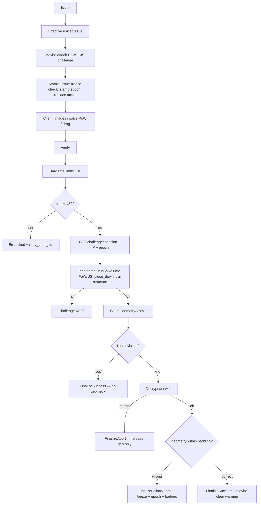

# antibot

AntiBot orchestration around go-captcha (Slide / Rotate): **one-shot geometry**, session+IP binding, escalating freeze, adaptive PoW, JS workloads, trajectory risk, and optional invisible/a11y modes.

This document explains **how decisions are made**, **what is checked**, and **which delays/TTLs apply**. For API surface details see also [`client/`](client/) and [`example_http_test.go`](example_http_test.go).

---

## Mental model

AntiBot does **not** “prove a human”. It stacks **hard gates** (must pass or request fails) and **soft signals** (raise persistent risk → more PoW / Hard Mode next time).

| Layer | What it does | On failure |
|-------|----------------|------------|
| **Hard gates** | UA/JS, timing floor, PoW, piece press, geometry (or invisible path) | Request fails; geometry **not** consumed on tech fails |
| **Soft risk** | Trajectory score, browser consistency, fingerprints, fail-rate, sessrot, reputation | Risk ↑; next Issue harder |
| **Abuse state** | `/32` freeze, IP epoch, single `active` challenge, traj replay | Blocks Issue/Verify or invalidates old challenges |

**1 visual challenge = 1 geometry attempt.** Wrong or right answer both consume the challenge. Tech errors (PoW/JS/too-fast/piece) keep it.

---

## End-to-end flow



---

## Issue — how a challenge is minted

1. **Validate** `ClientKey` (must be session id, not raw IP) and **authoritative IP** (`ClientSignals.IP`).
2. **Hard rate limits** (any bucket over limit → `ErrRateLimited`):
   - session (`IssueRateMax`, default **30 / min**)
   - exact `/32`
   - global (`GlobalIssueRateMax`, default **10000 / min**)
3. Reject obvious non-browser UA if `RequireBrowserSignals()` (default on).
4. **Effective risk** (see below) → choose PoW difficulty; mint rotating JS challenge.
5. Optional **invisible**: if `EnableInvisible` && `PreferInvisible` && risk ≤ `InvisibleMaxRisk` → `KindInvisible` (no puzzle image; light PoW still attached).
6. **`IssueChallengeAtomic`** (one lock / Lua):
   - if `freeze` set → `ErrLocked` + `retry_after_ms`
   - read `epoch`, stamp `IPEpoch` on record
   - delete previous `active` challenge key
   - SET new `ch:` + `active=id` (TTL = challenge TTL)
7. Distinct **session rotation**: `SET NX sessseen` → only then `INCR sessrot`.

Client receives: `id`, `ttl_seconds`, `pow?`, `js_challenge`, `hard_mode?`, `mode` (`visual` / `invisible` / `a11y`).  
**Never** send `GetData()` / encrypted answer.

---

## Verify — decision order (authoritative)

### 1. Request hygiene
- Valid challenge id, session key, answer JSON size ≤ `MaxAnswerBytes` (4096)
- Trajectory size caps: **2000** points / **500** events
- PoW nonce length ≤ **64**

### 2. Identity + freeze
- Resolve `/32` HMAC (`ipHash`)
- If `freeze` present → **`ErrLocked`** + `retry_after_ms` (Issue and Verify both blocked)
- Hard verify rate limits (session / `/32` / global)

### 3. Read-only bind
- Load challenge; check expiry
- `ClientHash` and `IPHash` must match Issue (mismatch → `ErrNotFound`, no leak)
- `IPEpoch` must equal current IP epoch (stale after bad geometry → `ErrNotFound`)

### 4. Tech gates — **do not consume** the challenge
| Check | Default | Fail error |
|-------|---------|------------|
| Server elapsed since Issue | `MinSolveTime` = **300ms** | `ErrTooFast` |
| Bound PoW | if `PoWDiff > 0` | `ErrPoWInvalid` |
| JS workload response | required unless `AllowNonBrowser` | `ErrJSChallengeFailed` |
| `piece_down` (slide/rotate) | required; dwell ≥ **16ms** | `ErrPiecePressRequired` |
| Trajectory structure | ≥3 points, down→move→up, monotonic t, jumps ≤ **800px** | soft issues → risk; not hard-fail alone |

### 5. Claim (one-shot)
`ClaimGeometryAtomic`: freeze clear, geo lock free, bind+epoch+active match → SET `geo` (TTL `GeoLockTTL` **5s**), DELETE `ch` + `active`.  
Parallel verifies on same `/32`: one wins; others busy/`ErrLocked`/`ErrNotFound`.

### 6. After claim
| Outcome | Action |
|---------|--------|
| Decrypt / internal error | **`FinalizeAbort`** — release geo only (no freeze/risk/epoch) |
| Wrong geometry | **`FinalizeFailureAtomic`** — `badgeo++`, freeze, bind lock, IP risk++, **epoch++**, delete geo → `ErrBadAnswer` + `retry_after_ms` |
| Correct geometry / invisible OK | **`FinalizeSuccess`** — release geo; record traj fingerprint; evaluate risk; clear warmup only if **clean** |

### 7. Optional hard reject
If `HardRejectScore > 0` and behavior score &lt; threshold → `ErrLowScore` (default **off**).

---

## How risk / PoW decisions are made

### Effective risk at Issue
Rough sum (clamped to `MaxRiskLevel`):

- persistent session risk + max(`/32` risk)
- +1 new-session **warmup** (unless disabled)
- +1 if distinct `sessrot` ≥ **8** on this `/32`
- soft `/24` issue pressure, browser/UA hints, consistency, optional fingerprints
- optional `ReputationProvider.RiskDelta`
- `Suspicious` forces at least level 1

### PoW attachment
| Situation | Default behavior |
|-----------|------------------|
| risk ≥ 1 | `PoWBaseDifficulty` **14** + `(level-1)*2`, cap **22**, +0..`PoWJitterBits` (1) |
| risk 0 | ~**8%** probe at difficulty **10** (`PoWProbeProb`) |
| Hard Mode | +`HardModeExtraPoWBits` (**2**), TTL × **0.5** |
| risk ≥ `StretchPoWRiskMin` (**3**) | optional `kind=stretch` memory mix (still leading-zero bits) |
| Invisible | at least probe-level PoW |

**Bound PoW preimage:** `challengeID:sessionBind:salt:nonce` → SHA-256 leading zero bits.

### Risk after Verify (`EvaluateRisk`)
Increases on: suspicious / low trajectory score, young session (&lt; `MinSessionAge` **2s**), high fail rate (≥ **0.6** with ≥5 issues), high issue rate (≥ **20**/min), browser deltas, failed geometry.  
**Clean solve** (geometry OK + consistent traj + no browser delta + session age OK): session risk **−1** (gradual), soft `/32` risk −1; warmup cleared.

Trajectory score is a **risk signal**, not a humanity proof.

---

## Delays, TTLs, and retries

| Parameter | Default | Meaning |
|-----------|---------|---------|
| Challenge `TTL` | **90s** | Challenge / `active` key lifetime |
| `MinSolveTime` | **300ms** | Earliest Verify after Issue |
| `GeoLockTTL` | **5s** | In-flight geometry lock; busy → retry ~this long |
| Session cookie | **24h** | Survives challenge; holds risk/warmup |
| `RiskTTL` / `FailRateWindow` | **1h** | Risk, fails, issues, sessrot, badgeo, epoch hygiene |
| Freeze after bad #1…5+ | **2s → 5s → 15s → 60s → 300s** | `/32` + session bind; survives cookie delete |
| Piece dwell | **16ms** | Min time from `piece_down` to first move |
| Slide / rotate padding | **5px / 5°** | Geometry tolerance (server-only) |
| Rate window | **1m** | Issue/Verify counters |
| Hard Mode trigger | bad/issue ≥ **0.45** (≥20 issues) or ≥**40** abs bads | Shorter TTL, extra PoW |
| Replay fingerprint | = FailRateWindow | Soft risk if same traj reused after a **success** |

API surfaces wait time as **`retry_after_ms`** on `ErrLocked` / `ErrBadAnswer` (`RetryAfterMs(err)`).

---

## Identity model

| Key | Role |
|-----|------|
| Session cookie (`ClientKey` = `sid:…`) | Challenge binding, warmup, session risk |
| Exact IPv4 `/32` (HMAC with SecretKey) | Freeze, geo lock, epoch, hard RL, IP risk |
| IPv4 `/24` + ASN | Soft → risk only (never sole hard-block) |

IP extraction: `RemoteAddr` unless peer ∈ `TrustedProxies`, then `X-Real-IP` / `X-Forwarded-For`. Spoofed XFF from untrusted peers is ignored.

**Prefetch protection:** only one `active` challenge per `/32`; Issue replaces previous. Bad answer bumps **epoch** → all older stamped challenges fail Claim/Verify.

---

## Hard vs soft checks (cheat sheet)

**Hard (fail request):** freeze; rate limit; missing IP; bind/epoch miss; too fast; bad PoW; bad/missing JS (browser mode); missing piece press; wrong geometry; optional `HardRejectScore`.

**Soft (raise risk / next PoW):** trajectory quality, intervals/dynamics, browser consistency, soft fingerprints, sessrot, fail-rate, `/24`, replay after success, reputation provider.

**Never burn geometry:** PoW/JS/timing/piece/malformed (before claim).

**Never freeze for server bugs after claim:** use `FinalizeAbort`.

---

## Slide / Rotate visual notes

- Slide: decoy holes (default **4**), real slot random among **top-K** textured candidates; tile photometric distort (not a raw crop).
- Rotate: independent noise / illumination / soft occlusion on master vs thumb.
- Public API still only start pose; secret remains one `(X,Y)` or angle.

---

## Quick start

```go
secret, _ := antibot.GenerateSecretKey(32)
layer, err := antibot.New(antibot.NewRedisStore(rdb), antibot.Config{
    SecretKey:  secret,
    TTL:        90 * time.Second,
    GeoLockTTL: 5 * time.Second,
    // TrustedProxies: []netip.Prefix{netip.MustParsePrefix("10.0.0.0/8")},
})

sess, _, _ := antibot.EnsureSessionCookie(w, r, secret, antibot.DefaultSessionCookie, antibot.DefaultSessionTTL)
signals := antibot.SignalsFromRequestTrusted(r, sess, nil)

answer, _ := json.Marshal(captData.GetData())
iss, err := layer.Issue(ctx, antibot.IssueRequest{
    Kind: antibot.KindSlide, Answer: answer,
    ClientKey: sess.ClientKey, Signals: signals,
})

res, err := layer.Verify(ctx, antibot.VerifyRequest{
    ID: iss.ID, ClientKey: sess.ClientKey, Signals: signals,
    Browser: browserFromJSON, // js_challenge_response
    Answer: mustJSON(antibot.SlideSubmit{X: ux, Y: uy}),
    Trajectory: antibot.Trajectory{Points: pts, Events: ev, PieceDown: pd},
    PoWNonce: nonce,
})
```

---

## Client protocol

[`client/antibot-client.js`](client/) — trajectory + piece press, rotating JS workloads, bound PoW (Workers), verify POST.  
Optional: [`fingerprints.js`](client/fingerprints.js), [`react.js`](client/react.js) / [`vue.js`](client/vue.js).

| Wire | Formula |
|------|---------|
| PoW | `SHA-256(challengeID:bind:salt:nonce)` leading zero bits |
| JS | `SHA-256(nonce\|id\|token\|workDigest\|probeValue)` — exact probe only (no `"1","2","3"` fillers) |

Demo should show `retry_after_ms` on locked / bad_answer and **re-Issue** a new image (never reuse id after geometry).

---

## Store / Redis Cluster

`Store`: atomic `Incr` / `IncrBy` / `GetDel` / `SetNX`.  
`GeometryStore`: `IssueChallengeAtomic`, `ClaimGeometryAtomic`, `FinalizeFailureAtomic`, `ReleaseGeoLock`.  
IP Lua keys share hash tag `{ipHash}` (`…:ip:{hash}:freeze|geo|epoch|active|ch:…`). Redis ≥ 6.2 for `GETDEL`.

---

## Config defaults (summary)

| Knob | Default |
|------|---------|
| `TTL` | 90s |
| `GeoLockTTL` | 5s |
| `MinSolveTime` | 300ms |
| `IssueRateMax` / `VerifyRateMax` | 30 / 60 per minute |
| `PoWBaseDifficulty` / max / probe | 14 / 22 / 10 @ 8% |
| `RiskThreshold` | 0.5 (soft) |
| `HardRejectScore` | 0 (off) |
| `MinSessionAge` | 2s |
| `SlidePadding` / `RotatePadding` | 5 |
| Session cookie TTL | 24h |
| Browser / piece press | required |

See `Config` in [`config.go`](config.go) for the full list (Hard Mode, stretch PoW, invisible, replay, reputation).
